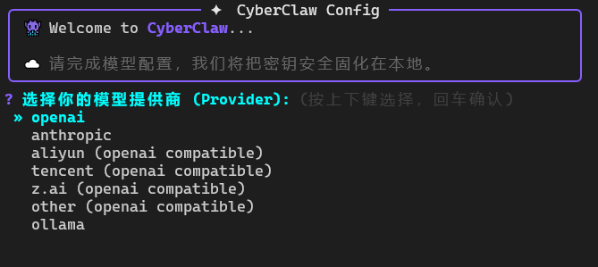
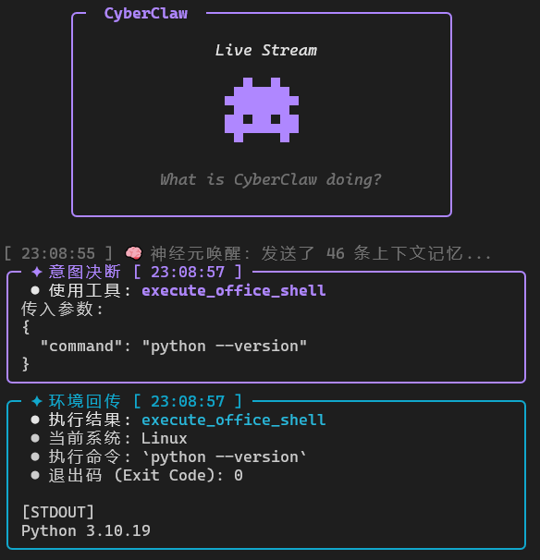

<div align="center">

# Clawgent

### **科研智能助手 · 可溯源的深度调研与知识库问答**

导航: [简介](#-简介) · [核心能力](#-核心能力) · [快速开始](#-快速开始) · [系统架构](#-系统架构) · [子系统详解](#-子系统详解) · [内置工具](#-内置工具) · [目录结构](#-目录结构)

</div>

---

## 📖 简介

Clawgent 是一个面向科研场景的智能体运行时，基于 **LangGraph** 构建，围绕三条主线：

- **📚 学术检索与私有知识库** —— 通过原生 MCP 接入 arXiv / Semantic Scholar / PubMed 等学术数据源；本地知识库走 Agentic RAG（混合召回 + 多跳推理），所有结论强制标注来源，可溯源不编造。
- **🔬 多智能体深度调研** —— LangGraph 子图驱动 Planner→并发 Researcher→Critic 交叉验证→Judge 评审→结构化报告，证据缺口自动补检索。
- **🛡️ 过程可追溯** —— 每一步 LLM 调用、工具调用、工具结果全程异步审计落盘 JSONL，实验过程可复现；Shell 命令在 Docker 容器内隔离执行，路径经真实路径校验防越权。

### 技能生态兼容

技能以目录形式挂载在 `workspace/office/skills/`，懒加载（启动时只扫元数据，首次调用才读全文）。同时兼容 OpenClaw / Claude Code 两套技能生态，无需改写。

---

## 🌟 核心能力

| 能力 | 实现要点 |
|------|---------|
| **学术源 MCP 接入** | `langchain-mcp-adapters` 原生接入，arXiv(无需 key)/Semantic Scholar/PubMed 并发检索，归一化为统一证据格式 |
| **私有知识库 RAG** | 向量(Chroma)+BM25(jieba) 混合召回 → RRF 融合 → 远程 Rerank → Self-RAG 过滤 → CRAG 补检索；父块/子切片两级分层 |
| **多跳推理 RAG** | IRCoT 循环：单轮检索→压缩结论→推理下一子问题，最多 4 轮，三重终止防死循环 |
| **多智能体调研** | LangGraph 子图，Send API fan-out 并发 Researcher，Critic 找缺证/矛盾，Judge 条件路由，产出带引用的 Markdown 报告 |
| **学术 PDF 解析** | 可插拔后端：MinerU 官方 API（保留公式/表格/双栏结构）+ PyPDF2 自动降级 |
| **过程审计** | 单例异步 JSONL 日志器，4 类事件（llm_input/tool_call/tool_result/ai_message），独立监控终端实时回放 |
| **Docker 沙盒** | Shell 命令在 `python:3.10-slim` 容器内执行，60s 超时熔断，`os.path.realpath` 防软链接越权 |
| **双水位记忆** | 长期画像(Markdown) + 近期摘要(按回合裁剪+滚动压缩)，跨会话记住研究方向与偏好 |
| **多模型适配** | OpenAI 兼容(OpenAI/阿里云/腾讯/Z.AI) / Anthropic / Ollama 工厂模式统一接入 |

---

## 🚀 快速开始

### 1️⃣ 安装

```bash
git clone https://github.com/ttguy0707/Clawgent.git
cd Clawgent

python -m venv venv
source venv/bin/activate   # Windows: venv\Scripts\activate
pip install -e .
```

> Shell 工具依赖 **Docker**；学术检索依赖 **uv**（`pip install uv`，用于 `uvx` 拉起 MCP server）。

### 2️⃣ 配置

```bash
clawgent config   # 交互式向导，自动测试连接
# 或手动：
cp .env.example .env
```



关键环境变量：

```bash
# 主对话模型（以阿里云为例）
DEFAULT_PROVIDER=aliyun
DEFAULT_MODEL=glm-5
OPENAI_API_KEY=sk-xxx
OPENAI_API_BASE=https://dashscope.aliyuncs.com/compatible-mode/v1

# PDF 解析后端：pypdf2（默认）| mineru（学术 PDF 推荐）
RAG_PDF_BACKEND=pypdf2
MINERU_API_KEY=

# RAG：Embedding + Rerank 走 SiliconFlow OpenAI 兼容接口
RAG_EMBEDDING_API_KEY=
RAG_RERANKER_API_KEY=

# 学术检索 MCP（开启后接入 arXiv 等）
ACADEMIC_MCP_ENABLED=false
SEMANTIC_SCHOLAR_API_KEY=   # 可选，提额度
PUBMED_API_KEY=             # 可选，生物医学

# 联网调研
TAVILY_API_KEY=
```

### 3️⃣ 启动

```bash
clawgent              # 交互式终端
python entry/monitor.py   # 另开窗口：实时审计监控
```



### 4️⃣ 开启学术检索

```bash
# .env 中设置
ACADEMIC_MCP_ENABLED=true

# 安装 uv（uvx 按需拉起 MCP server）
pip install uv
uvx arxiv-mcp-server --help   # 验证 arXiv MCP 可用
```

启用后，对话中直接说"查一下 arXiv 上关于 Mamba 架构的论文"即可。

### 5️⃣ 启用高质量 PDF 解析（可选）

```bash
# .env 中设置（学术 PDF 含公式/双栏时推荐）
RAG_PDF_BACKEND=mineru
MINERU_API_KEY=your_key
```

把论文 PDF 放入 `workspace/knowledge_base/`，对话中说"重建知识库索引"即可。

---

## 🏗️ 系统架构

```
                       ┌─────────────────────────────┐
  用户 ───────────────▶│     主 Agent 循环（LangGraph）  │
                       │  agent_node ⇄ ToolNode        │
                       └─────────────┬───────────────┘
       ┌─────────────┬───────────────┼────────────────┬─────────────┐
       ▼             ▼               ▼                ▼             ▼
  ┌─────────┐  ┌──────────┐  ┌────────────┐  ┌───────────┐  ┌──────────┐
  │双水位记忆│  │Docker沙盒│  │ Agentic RAG│  │多智能体调研│  │学术MCP   │
  │画像+摘要│  │文件/Shell │  │混合检索管线│  │LangGraph  │  │arXiv等   │
  └─────────┘  └──────────┘  └────────────┘  │子图       │  └──────────┘
                                              └───────────┘
                                    │               │
                       ┌────────────▼───────────────▼──────┐
                       │   异步 JSONL 审计日志 + 监控终端     │
                       └────────────────────────────────────┘
```

**多智能体调研子图（`deep_research`）：**

```
START → planner ──[Send fan-out]──▶ researcher×N ──▶ aggregator
                  (并发, operator.add reducer)            │
   compiler ◀── judge ◀── revision ◀── critic ◀──────────┘
      │           └─(high 级问题未达标)──▶ critic（最多 max_revisions 轮）
      ▼
    END（Markdown 报告 + 置信度 + 引用来源）
```

---

## 🧩 子系统详解

### 📚 学术检索 MCP（[research/academic.py](clawgent/core/research/academic.py)）

- `MultiServerMCPClient` 同时连接多个学术 MCP server，进程内懒初始化并缓存工具列表。
- **arXiv**：无需 key，`uvx arxiv-mcp-server` 按需拉起，CS/物理/数学预印本。
- **Semantic Scholar**：可选 key（提速率上限），跨学科 + 引用图谱 + TLDR 摘要。
- **PubMed**：配置 `PUBMED_API_KEY` 后启用，生物医学权威源。
- 任何 server 连接失败自动跳过，不阻断其余源。
- 检索结果归一化（url/title/snippet/authors/year/source），**学术源优先级高于普通网页**，直接汇入 `deep_research` 的 Critic/Judge 证据链。

### 📄 Agentic RAG（[core/rag/](clawgent/core/rag/)）

两级自适应分流：

| 工具 | 适用 | 管线 |
|------|------|------|
| `search_knowledge_base` | 单点事实查询 | `search_agentic()`：Adaptive策略→混合召回→RRF→Rerank→Self-RAG→CRAG |
| `deep_query_knowledge_base` | 多跳/跨文档综合 | `search_iterative()`：IRCoT 循环（最多 4 轮）→ synthesize |

**可靠性**：每个 LLM 决策点经 `llm_call_with_reliability` 包装——retry → 方法级熔断器(CLOSED/OPEN/HALF_OPEN) → SQLite 死信队列持久化 → 降级返回。

**PDF 解析**（[rag/pdf_backends.py](clawgent/core/rag/pdf_backends.py)）：可插拔后端，`RAG_PDF_BACKEND=mineru` 时走 MinerU 官方 API（异步任务轮询，抽取结构化 Markdown），任何失败自动降级 PyPDF2，绝不阻断索引。

**存储**：Chroma 双集合持久化（子切片向量检索，父块 ID 回溯取完整上下文）；BM25 语料绑定子切片。

### 🔬 多智能体深度调研（[core/research/](clawgent/core/research/)）

`deep_research` 工具触发独立 LangGraph 子图：

- **Planner**：拆 3-6 个子任务，Send API 并发分发（`operator.add` reducer 汇聚，防并发写冲突）。
- **Researcher**：每个子任务跑 `hybrid_search`（**学术 MCP + Tavily + 本地 RAG** 三路合并），LLM 抽取 claim 级证据并绑定来源 URL。
- **Critic**：Red-team 找缺证/事实矛盾/逻辑漏洞，只保留 high/medium 级问题触发补检索。
- **Judge**：`Command` 条件路由——未达标且未超 `max_revisions` 次则回 critic，否则编译。
- **Compiler**：按子任务分组证据，产出含执行摘要、分节发现、参考来源的完整 Markdown 报告。

### 🧠 双水位记忆（[core/context.py](clawgent/core/context.py)）

- **长期画像**：`workspace/memory/user_profile.md`，记研究方向/偏好，每轮注入系统 Prompt。
- **近期摘要**：按完整对话回合裁剪，超阈值自动摘要交接（只记任务进度，不记静态偏好），`RemoveMessage` 清旧消息防 Token 爆炸。

---

## 🔧 内置工具

| 工具 | 功能 |
|------|------|
| `search_academic` | **学术论文检索**（arXiv/Semantic Scholar/PubMed，MCP 接入） |
| `search_knowledge_base` | 私有知识库单轮快查 |
| `deep_query_knowledge_base` | 私有知识库多跳深挖 |
| `rebuild_knowledge_index` | 重建向量索引（新增/修改文档后） |
| `deep_research` | 多智能体联网深度调研，输出结构化报告 |
| `get_current_time` | 当前系统时间 |
| `calculator` | 数学表达式计算 |
| `get_system_model_info` | 当前 provider / model |
| `save_user_profile` | 更新长期画像 |
| `schedule_task` / `list_scheduled_tasks` / `delete_scheduled_task` / `modify_scheduled_task` | 定时/循环任务（含时间歧义确认与批量删除风控） |
| `list_office_files` / `read_office_file` / `write_office_file` | office 工位文件操作 |
| `execute_office_shell` | Docker 容器内 Shell 执行 |

外部技能（`workspace/office/skills/`）经懒加载器注册为动态工具，`mode='help'` 先读说明书、`mode='run'` 再执行。

---

## 📁 目录结构

```
Clawgent/
├── clawgent/
│   └── core/
│       ├── agent.py             # 主 Agent 循环（LangGraph 状态图）
│       ├── context.py           # 双水位记忆：回合裁剪 + 摘要
│       ├── config.py            # 全局路径与各子系统配置
│       ├── provider.py          # 多模型工厂
│       ├── logger.py            # 单例异步 JSONL 审计日志器
│       ├── heartbeat.py         # 心跳任务协程
│       ├── skill_loader.py      # 懒加载技能加载器（多格式兼容）
│       ├── tools/
│       │   ├── academic_tool.py # 学术检索工具（MCP 封装）
│       │   ├── rag_tools.py     # RAG 工具封装
│       │   ├── research_tool.py # 深度调研工具封装
│       │   ├── sandbox_tools.py # Docker 沙盒文件/Shell 工具
│       │   └── builtins.py      # 工具注册表
│       ├── rag/
│       │   ├── service.py       # Agentic RAG（search_agentic / search_iterative）
│       │   ├── vector_store.py  # Chroma 双集合 + BM25
│       │   ├── pdf_backends.py  # 可插拔 PDF 后端（PyPDF2 / MinerU API）
│       │   ├── loader.py        # 文档加载器
│       │   └── reliability.py   # 熔断器 + 死信队列
│       └── research/
│           ├── graph.py         # 多智能体调研子图
│           ├── nodes.py         # Planner/Researcher/Critic/Judge/Compiler 节点
│           ├── academic.py      # 学术 MCP 客户端（arXiv 等）
│           └── search.py        # hybrid_search（学术+Web+RAG）
├── entry/
│   ├── cli.py                   # clawgent 命令入口 + 配置向导
│   ├── main.py                  # 交互式对话终端
│   └── monitor.py               # 实时审计监控终端
├── workspace/                   # 运行时数据（自动创建）
│   ├── memory/                  # 长期画像
│   ├── office/                  # 沙盒工位（唯一可执行区）
│   │   └── skills/              # 外部可插拔技能
│   ├── knowledge_base/          # RAG 语料（txt/md/pdf）
│   ├── kb_index/                # Chroma 向量索引 + DLQ
│   ├── state.sqlite3            # LangGraph checkpoint
│   └── tasks.json               # 定时任务持久化
├── docs/
├── requirements.txt · setup.py · .env.example
```

---

## 📄 License

[MIT](LICENSE) · 受 [OpenClaw](https://github.com/openclaw/openclaw) 启发。

<div align="center">

**👾 Clawgent · 科研智能助手 · 可溯源的深度调研与知识库问答**

</div>
