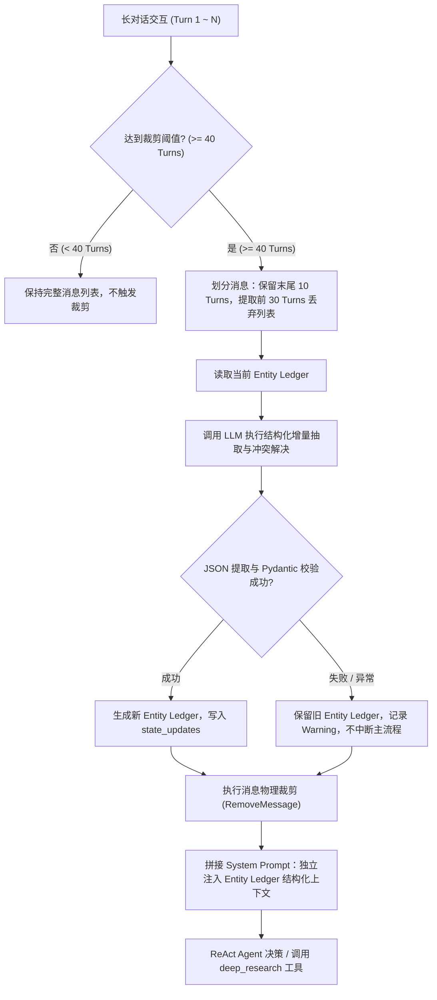

# Entity Ledger（实体白板）运行时状态管理规范与设计文档

## 1. 设计目的

在面向科研场景的可溯源智能体（CyberClaw）中，主线 0（智能体运行时）原有机制为：
- 会话达到 40 回合时触发裁剪，仅保留末尾 10 个回合；
- 被裁剪的前 30 个回合交给 LLM 融合生成一段不超过 150 字的自然语言 `summary`。

在深度科研调研中，这一机制存在严重的信息丢失隐患：
1. **语义压缩丢失科研硬约束**：例如用户在前 30 回合提出的“只关注 2024 年以后的无监督方法”、“限定单麦克风场景”、“排除某些基线”，在 150 字的自然语言总结中极易被概括为泛化的“讨论了声纹识别”，导致微观限定词丢失。
2. **递归压缩（Telephone Game）**：随着会话轮次进一步推进，多次触发裁剪时，summary 递归融合，细粒度限定条件迅速衰减。
3. **下游调研工具偏航**：主 Agent 根据失去约束的 summary 调用 `deep_research(query=...)`，导致下游 Planner 拆解出无关或过时的文献调研任务。

为了彻底解决上述痛点，本项目将主线 0 的上下文管理改造为：
> **Recent Conversation（短期上下文：最近 10 回合） + Entity Ledger（长期状态：结构化实体白板）**

Entity Ledger 是跨回合持久存在的**结构化 Research Canvas**，只记录对后续推理具有持续约束力和状态价值的信息，不承担完整历史对话记录的替代功能。

---

## 2. 数据模型与 Schema

Entity Ledger 基于 Pydantic v2 构建，具有严格的类型校验、序列化和脏数据清洗容错能力。核心包含三类结构化实体：

```json
{
  "global_constraints": [
    {
      "id": "constraint_1",
      "content": "只关注 2024 年以后的无监督方法",
      "source_turn": 5,
      "status": "active"
    }
  ],
  "resolved_entities": [
    {
      "id": "entity_1",
      "type": "model",
      "name": "ECAPA-TDNN",
      "description": "基于通道注意力的声纹识别时延神经网络模型",
      "source_turn": 8
    }
  ],
  "pending_questions": [
    {
      "id": "question_1",
      "question": "短语音场景下角边际损失函数的鲁棒性表现如何？",
      "source_turn": 12,
      "status": "pending"
    }
  ]
}
```

### 字段定义说明
1. **`global_constraints`（全局科研硬约束）**：
   - `id`: 唯一标识符（如 `constraint_xxx`）。
   - `content`: 具体的约束内容（时间范围、数据集、模型版本、实验条件、排除条件等）。
   - `source_turn`: 引入此约束的回合数。
   - `status`: 约束状态，必须为 `active`（生效中）、`inactive`（已停用）或 `removed`（已撤销）。
2. **`resolved_entities`（已确认事实实体）**：
   - `id`: 唯一标识符（如 `entity_xxx`）。
   - `type`: 实体类型，取值为 `paper|method|dataset|model|person|organization|other`。
   - `name`: 实体标准名称或消歧后的准确名称。
   - `description`: 实体关键特征、已达成共识的事实或消歧说明。
   - `source_turn`: 确立该实体的回合数。
3. **`pending_questions`（未决科研问题）**：
   - `id`: 唯一标识符（如 `question_xxx`）。
   - `question`: 待解决的研究问题描述。
   - `source_turn`: 提出该问题的回合数。
   - `status`: 问题状态，必须为 `pending`（待解决）或 `resolved`（已解决）。

---

## 3. 运行时生命周期与更新机制



### 核心更新与冲突消除规则
1. **修改约束**：当用户放宽或变更约束（例如从“只看 2024 年”改为“放宽到 2022 年”），系统复用原有 `constraint_id`，覆写 `content` 并保持 `status="active"`，严禁同时存在两个冲突的 active 约束。
2. **撤销约束**：当用户明确取消某项限制（例如“不限制数据集了”），将对应约束的 `status` 标记为 `removed` 或 `inactive`，下游 `get_active_constraints()` 自动过滤。
3. **实体消歧**：当用户明确具体型号或标准名称（例如从“BERT”明确为“BERT-base-uncased”），系统更新已有实体的 `name` 与 `description`，避免生成同名冗余实体。
4. **问题解决**：当未决问题在后续对话中得到解答或已得出定论，将其 `status` 更新为 `resolved`。
5. **抗噪性与事实严谨性**：严禁将模型自身的模糊猜测升级为 confirmed 约束或实体；严禁将闲聊、寒暄、临时命令等过程性信息写入白板。

---

## 4. 职责边界划分

| 模块 / 状态机制 | 职责定义 | 适用范围 | 存储介质 |
| :--- | :--- | :--- | :--- |
| **`Entity Ledger`** | **长期科研语义状态**：跨回合持续有效的硬约束、消歧事实实体、未决研究问题 | 主线 0 智能体运行时 | `AgentState["entity_ledger"]` |
| **`summary`** | **近期会话上下文摘要**：过渡性兼容机制，概括近期解决的问题 | 主线 0 智能体运行时 | `AgentState["summary"]` |
| **`evidence_state`** | **多跳检索证据状态**：记录多跳循环检索中收集到的证据 ID、单轮压缩结论、来源 ID | 主线 4 多跳检索循环 | `ResearchState["evidence_state"]` |
| **`ResearchLedger`** | **过程审计流水**：调研子图执行过程的只追加事件序列（任务派发、完成、失败、重开等） | 主线 1 调研流水线 | `ResearchState["ledger_events"]` |

---

## 5. 测试覆盖与自证方式

在 `tests/test_entity_ledger.py` 与 `tests/test_agent.py` 中完整实现了 16+ 个维度的自动化测试验证：

1. **空 Ledger 初始化**（`test_1_empty_ledger_initialization`）：验证默认状态与从空字典加载。
2. **新增 global constraint**（`test_2_add_global_constraint`）：验证从裁剪消息中增量抽取硬约束。
3. **新增 resolved entity**（`test_3_add_resolved_entity`）：验证抽取模型/论文等实体。
4. **新增 pending question**（`test_4_add_pending_question`）：验证抽取未决科研问题。
5. **修改同一 constraint**（`test_5_modify_same_constraint`）：验证覆写旧约束，消除冲突。
6. **撤销 constraint**（`test_6_revoke_constraint`）：验证撤销约束后置为 removed 并不再被 active 读取。
7. **实体消歧更新**（`test_7_entity_disambiguation`）：验证实体名称和属性更新。
8. **问题标记解决**（`test_8_pending_question_resolved`）：验证未决问题状态流转。
9. **无新信息时保持不变**（`test_9_no_new_info_ledger_unchanged`）：验证幂等性。
10. **LLM 返回非法 JSON**（`test_10_llm_returns_invalid_json`）：验证容错降级，保留旧状态。
11. **Schema 校验失败**（`test_11_schema_validation_failure`）：验证字段缺失时安全回退。
12. **LLM 超时/网络异常**（`test_12_update_failure_preserves_old_state`）：验证不抛错中断对话。
13. **历史裁剪后下游读取**（`test_13_context_trimming_downstream_read`）：验证 45 回合裁剪后，第 3 回合约束仍被成功格式化注入 Prompt。
14. **旧 Checkpoint 兼容**（`test_14_legacy_checkpoint_compatibility`）：验证老状态没有 `entity_ledger` 键时安全降级。
15. **普通闲聊过滤**（`test_15_chitchat_ignored`）：验证问候闲聊不写入白板。
16. **与 evidence_state 正交共存**（`test_16_coexistence_with_evidence_state`）：验证职责分离无冲突。
17. **Agent 节点端到端协同**（`tests/test_agent.py::test_agent_node_with_entity_ledger_trimming`）：验证长会话裁剪时 `agent_node` 触发更新并准确将硬约束送入模型 System Prompt。
