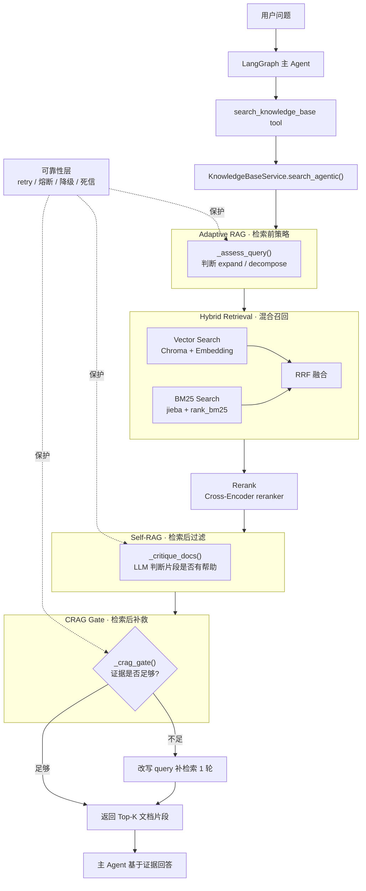

# Clawgent RAG System README

## 1. 系统定位

Clawgent 的 RAG 子系统用于为主 Agent 提供企业/校园知识库检索能力。
它不是独立问答服务，而是以工具的形式接入 LangGraph 主循环，在需要依据内部文档回答问题时参与决策。

当前实现采用**证据驱动的结构化 Agentic RAG**：

- 不使用完全自主的多轮工具乱序编排
- 使用固定检索管线保证稳定性
- 在关键决策点引入 LLM 判断，提升复杂问题下的检索质量
- 对 LLM 决策链路增加重试、熔断、降级、死信持久化，避免单点脆弱

- --

## 2. 整体架构

整体调用链如下：




- --

## 3.目录与核心文件

### 3.1 检索服务层

- `clawgent/core/rag/service.py`
 - RAG 主服务入口 `KnowledgeBaseService`
 - 负责查询分析、检索、融合、重排、Self-RAG、CRAG gate、可靠性降级

- `clawgent/core/rag/vector_store.py`
 - `SimpleVectorStore`
 - 负责 Chroma 向量索引、BM25 索引、文档写入、混合检索

- `clawgent/core/rag/reliability.py`
 - `CircuitBreaker`
 - `DeadLetterQueue`
 - `llm_call_with_reliability`
 - 负责 LLM 调用的 retry / 熔断 / 死信 / 降级

### 3.2 数据处理层

- `clawgent/core/rag/loader.py`
 - 加载 txt / md / pdf 文档

- `clawgent/core/rag/text_utils.py`
 - 文本归一化
 - 中文滑窗切分

### 3.3 工具接入层

- `clawgent/core/tools/rag_tools.py`
 - 暴露 `search_knowledge_base()`
 - 暴露 `rebuild_knowledge_index()`

- `clawgent/core/tools/builtins.py`
 - 将知识库工具注册到系统内置工具集合

### 3.4 配置层

- `clawgent/core/config.py`
 - RAG embedding / reranker / LLM 配置
 - 索引目录、知识库目录、chunk 参数等

- --

## 4. 检索链路说明

## 4.1 文档导入与索引构建

知识库文件放在：

- `workspace/knowledge_base/`

支持的格式：

- `.txt`
- `.md`
- `.markdown`
- `.pdf`

构建索引时执行：

1. 扫描知识库目录
2. 读取原始文档文本
3. 文本归一化
4. 按中文语义断点进行 chunk 切分
5. 对每个 chunk 做 document expansion
6. 写入 Chroma 向量库
7. 同时构建 BM25语料

其中 document expansion 的做法为：

```text
[文档: xxx]
原始 chunk 内容
```

作用：

- 把文档名并入索引内容
- 增强召回阶段对文档主题的感知
- 返回结果时仍使用 `raw_text`，避免把前缀污染给最终生成上下文

- --

## 4.2 Adaptive RAG：查询策略判定

`_assess_query()` 会先用一次 LLM 判断当前 query 类型，输出：

```json
{
 "expand": false,
 "decompose": false,
 "sub_queries": []
}
```

其职责是：

- **具体单一问题**：不扩写、不分解
- **模糊/口语化问题**：触发 query expansion
- **多子问题/多跳问题**：触发 query decomposition

目的：

- 避免所有问题都盲目扩写
- 避免 query drift
- 让复杂问题在固定管线里获得更高召回

- --

## 4.3 Query Expansion 与 Query Decomposition

## # Query Expansion

启用时会组合以下策略：

- LLM生成多条近义改写查询
- 本地同义词词典扩展（`synonyms.json`）

适用场景：

- 用户提问模糊
- 关键词表达不标准
- 语义不完整

## # Query Decomposition

启用时会：

1. 把复杂问题拆成2~4 个子问题
2. 各子问题独立检索
3. 合并到统一候选池
4. 仍然用**原始 query**做最终 rerank

这样做的原因：

- 子问题用于扩大召回
- 原始问题用于恢复最终语义对齐
- 降低 decomposition 带来的偏题风险

- --

## 4.4 Hybrid Retrieval：向量 + BM25

每个 query 都会同时走两条检索通路：

- **向量检索**：适合语义匹配
- **BM25 检索**：适合关键词精确命中

这样可以兼顾：

- 术语型问题
- 口语型问题
- 文档名 / 制度名 / 固定字段检索

BM25 的一个工程增强点：

- Chroma 可以持久化向量
- BM25 默认不会自动持久化
- 系统启动时会从 Chroma 集合恢复文档，重建 BM25语料
- 避免每次重启都必须全量 rebuild index

- --

## 4.5 RRF 融合

当系统存在：

- 多个 query
- 多种检索器（vector / BM25）

就会产生多份排序结果。

当前用 **RRF（Reciprocal Rank Fusion）** 合并：

```text
score +=1 / (k + rank +1)
```

优点：

- 不要求不同检索器分数同尺度
- 适合多路召回融合
- 实现简单且稳定

- --

## 4.6 Rerank

RRF 后得到候选池，再交给 Cross-Encoder reranker 做二次排序。

当前职责：

- 输入原始 query
- 对候选文档片段重新打分
- 输出更符合问题语义的最终排序

如果 reranker API 调用失败：

- 会降级为使用已有 `score`
- 不会中断整条链路

- --

## 4.7 Self-RAG：文档片段批量 Critique

`_critique_docs()` 是检索后的第一层 LLM 判断。

职责：

- 批量判断每个片段对回答 query 是否真的有帮助
- 过滤掉表面相关但无法支撑回答的片段

特点：

- 属于 **post-retrieval filtering**
- 使用 LLM 做绝对相关性判断
- 和 rerank 的“相对排序”能力互补

兜底机制：

- 若 LLM 把所有文档都过滤掉
- 至少保留 top-2，避免过度过滤导致空结果

- --

## 4.8 CRAG Gate：检索充分性评估 + 条件补检索

`_crag_gate()` 是检索后的第二层 LLM 判断。

职责：

- 判断当前保留下来的证据是否足够回答问题
- 如果不足，给出一个更精准的改写 query
- 用该 query 再补检索1轮

当前策略：

- **最多补检索1 次**
- 不做无限循环
- 补检索后的结果仍用**原始 query rerank**

原因：

- 防止 query drift
- 控制调用成本与延迟
- 保持最终排序目标一致

- --

## 5.可靠性机制

RAG里有三个 LLM 决策节点：

- `_assess_query()`
- `_critique_docs()`
- `_crag_gate()`

这些节点都要求模型返回固定 JSON 格式，因此增加了统一可靠性包装。

### 5.1 Retry

每次 LLM 调用支持固定次数重试：

- 默认最多2 次
- 首次失败后重试
- 如果依旧失败，则进入熔断计数与死信处理

失败原因包括：

- 模型未按 JSON 返回
- JSON结构不合法
- 远程 API 异常
- 网络波动

### 5.2 Circuit Breaker

采用**方法级熔断**，三个方法各自独立：

- `_cb_assess`
- `_cb_critique`
- `_cb_crag`

状态流转：

- `CLOSED`：正常调用
- `OPEN`：连续失败达到阈值后熔断，直接降级
- `HALF_OPEN`：超时后进入探测状态，允许一次试探恢复

默认参数：

- 连续失败3 次触发熔断
- 60 秒后尝试恢复

### 5.3 Degrade / Fallback

不同节点失败时采用不同降级策略：

- `_assess_query()`失败
 - 降级为：`expand=false, decompose=false`
 - 效果：退化成最保守的直查

- `_critique_docs()`失败
 - 降级为：不做过滤，返回原始列表
 - 效果：保留召回，不牺牲可用性

- `_crag_gate()`失败
 - 降级为：默认证据足够，不再补检索
 - 效果：直接返回当前结果，避免额外不稳定性

### 5.4 Dead Letter Queue

失败请求会持久化到本地 SQLite 死信队列：

- 路径：`workspace/kb_index/dlq.sqlite`

记录内容包括：

- 方法名
- query
- context
- error
- 创建时间
- 重试次数
- 状态

设计目的：

- 保留失败现场
- 便于后续排查模型格式问题
- 支持未来扩展为异步重试任务

当前实现：

- 已具备 SQLite 持久化能力
- 已具备后台线程消费框架
- 当前主链路仍以同步调用为主，默认只做持久化，不自动异步补偿

- --

## 6. 对外暴露能力

### 6.1 `search_knowledge_base(query)`

作用：

- 面向主 Agent 的知识库检索工具
- 返回多个高相关文档片段及来源

返回格式示例：

```text
[来源: 学生手册.pdf |相关性:0.9231]
……文档片段内容……
```

### 6.2 `rebuild_knowledge_index()`

作用：

- 扫描知识库目录并重建索引
- 首次接入知识库或文档更新后使用

- --

## 7. 当前系统特征总结

当前 RAG 子系统的核心特征：

1. **结构化 Agentic RAG**
 - 不是完全自治 Agent
 - 是固定检索骨架 + LLM 决策点

2. **三阶段决策链**
 - 检索前：Adaptive RAG
 - 检索后过滤：Self-RAG
 - 检索后补救：CRAG

3. **双路混合召回**
 - 向量检索 + BM25
 - 多 query 场景下用 RRF 融合

4. **可靠性增强**
 - retry
 - circuit breaker
 - degrade
 - dead letter queue

5. **工程可维护性**
 - 检索能力封装在 `KnowledgeBaseService`
 - 通过 tool 接入主 Agent
 - 可独立迭代，不污染主对话状态机

- --

## 8. 已知限制

当前版本仍有以下限制：

1. **仍依赖外部 embedding / reranker / LLM API**
 - 若密钥无效或余额不足，检索能力会受限

2. **死信队列默认未开启自动异步补偿**
 - 当前以持久化失败现场为主

3. **CRAG只允许单次补检索**
 - 这是为了控制 drift 与延迟
 - 若未来要做多轮 loop，需要额外引入终止条件与质量门控

4. **尚未引入 Graph RAG / Web fallback**
 - 目前仍以本地知识库检索为核心

- --

## 9.适合后续增强的方向

1. **结构化输出替代手写 JSON解析**
 - 用 schema/structured output 替换正则提取 JSON
 - 进一步降低 LLM 输出不规范带来的失败率

2. **死信异步重放**
 - 为 DLQ 增加真实 retry worker
 - 将失败请求做延迟补偿

3. **检索质量指标落库**
 - 记录各阶段命中数、重排分数、critique过滤率、gate触发率
 - 支撑后续评测与阈值调优

4. **Web / 外部知识源兜底**
 - CRAG 判断本地知识不足时，引入外部检索作为第二来源

5. **更强的可解释日志**
 - 输出每轮 query、每阶段得分、触发原因
 - 方便调试和问题回放
